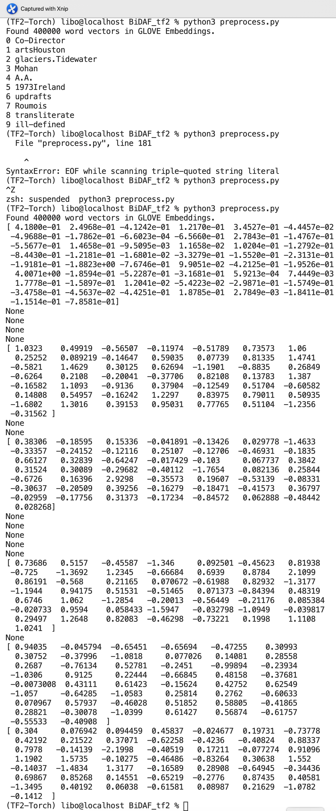

### 常见机器阅读理解模型（一）作业
#### 对代码中作业的部分进行填补，完成代码
1、在main.py中 实现论文中的glove和charCNN初始化embedding部分。
1) preprocess.py 实现加载glove到embedding matrix  （30'）
2）preprocess.py 实现nltk对语料的切分（30'）
3）main.py 实现从glove加载embedding 初始化（15'）
4）main.py 实现卷积char级别编码（15'）
5) main.py 实现word级别glove编码和char级别编码的拼接（10'）

### 作业代码说明
### 本次作业难度很大，目前只能在preprocess.py跑通程序，但是在main.py上无法跑通，无法验证测试结果是否正确，因此这次作业只能提供一些思路和部分解决方案。主要涉及的文件是preprocess.py和main.py这两个文件。
### 首先看preprocess.py文件。
#### 1. 引入相关的第三方包，本次代码运行环境是tensorflow2.3.1，使用tensorflow2自带的keras包进行运算，可以使用keras包的Tokenizer对英文进行分词，按照本作业的要求，仍然按照nltk进行分词，这里使用nltk的tokenize包，采用了glove.6B文件夹中的最小的文本集合glove.6B.50d.txt作为预训练词向量进行计算.

```python
import numpy as np
import data_io as pio
from tensorflow.keras.preprocessing.text import Tokenizer 
from tensorflow.keras.preprocessing.sequence import pad_sequences
from nltk.tokenize import word_tokenize
```

#### 2. 在Preprocessor类的初始化列表中添加embedding_fp参数,作为导入glove.6B文件夹的地址参数

```python
class Preprocessor:
    #在初始化列表中添加embedding_fp,导入glove.6B文件夹
    def __init__(self, datasets_fp, embedding_fp, max_length=384, stride=128):
        self.datasets_fp = datasets_fp
        self.embedding_fp = embedding_fp
        self.max_length = max_length
        self.max_clen = 100
        self.max_qlen = 100
        self.stride = stride
        self.charset = set()
        # self.build_charset()
        self.embedding_index = {}
        self.concat_cqa_words_list = []  # 去重复后的cqa单词列表
        self.build_gloveset()
        self.tokenize_text()
        self.WordEmbedding()
    
```

#### 3. 通过创建Preprocessor类的build_gloveset函数，导入GLove预训练词向量，形成长度400000的词典embedding_index，其中的键为Glove中的单词，值为该单词的预训练词向量。

```python
def build_gloveset(self):
    for fp in self.embedding_fp:
        with open(fp, encoding='utf-8') as f:
            for line in f:
                word, coefs = line.split(maxsplit=1) # maxsplit=1,只对第一个出现的空格进行分割
                coefs = np.fromstring(coefs,'f',sep=' ') # fromstring: 将字符串按照分隔符解码成矩阵
                self.embedding_index[word] = coefs 
    print('Found %s word vectors in GLOVE Embeddings.'%len(self.embedding_index))    
```

#### 4. 对上下文和问答文本进行分词。通过dataset_words_info()函数获取的上下文、问答文本是每个字符组成的列表，有必要对其进行合并再通过nltk进行重新分词。其中上下文的分词列表为concat_context_words_list，总共有144707个单词（去重复后）;问句文本的分词列表为concat_question_words_list，总共有48379个单词（去重复后），回答文本的分词列表为concat_answer_words_list, 总共有95061个单词（去重复后），所有上下文和问答综合文本的分词列表为concat_cqa_words_list，总共有220858个单词（去重复后），是少于glove的词个数的。本次作业使用包含上下文和问答cqa的综合文本列表concat_cqa_words_list，对每个词生成相应的词嵌入。
```python
def tokenize_text(self):
    cqa_chars_list = []
    
    for fp in self.datasets_fp:
        context_chars, question_chars, answer_chars = self.dataset_words_info(fp)
        cqa_chars_list.extend(context_chars+question_chars+answer_chars)
    
    concat_cqa_chars = "".join(cqa_chars_list)

    self.concat_cqa_words_list =list(set(word_tokenize(concat_cqa_chars))) 
    return len(self.concat_cqa_words_list)
```

#### 5. 实现glove加载到Word Embedding层，形成embedding矩阵embedding_matrix,如果cqa中的词语是收录在glove词表中的词语，直接给该词语附上相应的词向量;对于cqa中没有收录在glove词表中的词语，我们先默认其词向量为0向量。

```python
def WordEmbedding(self):
    embedding_dim = len(list(self.embedding_index.values())[0])
    num_words = min(len(self.concat_cqa_words_list), len(self.embedding_index))
    self.embedding_matrix = np.zeros((num_words, embedding_dim))  ##首先用0初始化嵌入矩阵
    print(self.embedding_index['the'])

    for i, word in enumerate(self.concat_cqa_words_list):
        embedding_vector = self.embedding_index.get(word)
        
        # 如果cqa中的词语是收录在glove词表中的词语，直接给该词语附上相应的词向量
            
        if embedding_vector is not None:
            self.embedding_matrix[i] = embedding_vector
        # 对于cqa中没有收录在glove词表中的词语，我们先默认其词向量为0向量。

    return 0
```

#### 6. 计算结果
- 我们可以打印词嵌入矩阵embedding_matrix的前10行进行比较，通过下图可以看到，前10行的cqa词为Co-Director, artsHouston, glaciers.Tidewater, Mohan, A.A., 1973.Ireland，updrafts, Roumois, tranliterate, ill-defined.然而这些词不是所有都能在GLOVE收录的，没有被收录的则被标记为None，被GLOVE收录的词则按照预训练模型的词向量赋予这些词作为值，形成键值对词典。





### 然后看main.py文件。

#### 7. 引入一个Constant作为模型初始化的embedding矩阵，在main.py文件头部添加引入包声明如下：

```python
from tensorflow.keras.initializers import Constant
```

#### 8.在build_model()函数中将tf.keras.layers.Embedding中的参数embeddings_initializer对应的参数值'uniform'改为Constant(self.embedding_matrix)，这里的embedding_matrix就是第5步所实现的词嵌入矩阵